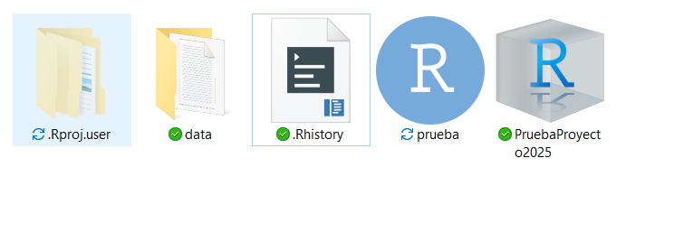

{fig-align="center" width="613"}

Independientemente de si estás dando tus primeros pasos en R o si ya eres un experto, es frecuente que la primera línea de tu código sea algo como esto:

``` r
setwd("C:\Users\miguel\ruta\que\solo\yo\tengo")
```

`setwd()` toma una ruta absoluta y la establece como el directorio de trabajo activo. El utilizar una ruta absoluta como directorio de trabajo hace que sea difícil de reproducir o de mover ya que otra persona u otro equipo no tiene esa misma ruta absoluta.

# ¿Qué es un proyecto de Rstudio?

Es un archivo especial que al ejecutarlo hará tres cosas:

-   Abrirá una nueva sesión de Rstudio.
-   Establecerá la ubicación del proyecto como tu **directorio de trabajo**.
-   Establecerá la ubicación del proyecto como la raíz de los archivos.

De esta forma, los proyectos de RStudio resuelven el problema de las rutas 'frágiles' al hacer que las rutas de archivo sean **relativas** a la raíz.

El archivo de proyecto de RStudio es un archivo que se encuentra en el directorio raíz, con la extensión `.Rproj` {width="46"}. Cuando tu sesión de RStudio está siendo ejecutada a través del archivo de proyecto (.Rproj), el directorio de trabajo actual apunta a la carpeta raíz donde se guarda ese archivo `.Rproj`.

Este proyecto facilita importar y exportar archivos ya que todos están *a la mano* a partir de rutas relativas a la carpeta raíz.

::: callout-tip
Otra gran ventaja de los proyectos de Rstudio, es que puedes compartirlo con otra persona manteniendo la estructura de las rutas relativas, de manera que no importa en donde se guarde el proyecto o si esta utilizando otro sistema operativo, las rutas relativas permanecen funcionales siempre y cuando abra la sesión utilizando el proyecto (.Rproj).
:::

Un ejemplo de como podemos estructurar un proyecto es el siguiente:

{fig-align="center" width="455"}

-   **Datos:** Esta es la carpeta en la que se guardan los archivos que necesito leer en R para realizar mi análisis o visualización. Estos pueden ser CSV, TXT, TSV, etc. La idea principal de tener esta carpeta es que estos archivos crudos en ningún momento debería sobrescribir o editar para garantizar la reproducibilidad.

-   **Script:** Aquí es donde puedes guardar los scripts de R y/o archivos RMarkdown o Quarto.

-   **Salida:** En esta carpeta puedes guardar todas tus salidas, incluyendo gráficos, HTML y tablas, etc. Tener esta carpeta de Salida ayuda a otros a identificar qué archivos son resultados del código, en contraste con los archivos fuente que se utilizaron para producir el análisis.

# Como generar un proyecto nuevo

Para crear un proyecto nuevo sigue estos pasos:

1.  Abre Rstudio y selecciona `Archivo` -\> `Nuevo Proyecto`

{fig-align="center" width="253"}

2.  Selecciona `Nueva Carpeta` si estas empezando el proyecto desde cero o `carpeta existente` si deseas crear un proyecto dentro de alguna carpeta que ya tengas

{fig-align="center" width="394"}

3.  Da un nombre a tu proyecto y ¡listo! ya puedes empezar a trabajar.

El proyecto R que has creado estará en una carpeta que contiene un archivo *`.Rproj`*. Este archivo es un acceso directo y probablemente la forma más directa de abrir tu proyecto. También puedes abrir un proyecto seleccionando "Open Project" en el menú File. Alternativamente, en el extremo superior derecho de RStudio verás un icono de R projects y un menú desplegable de proyectos disponibles.

{fig-align="center" width="186"}

Para salir de un proyecto R, abre un nuevo proyecto o cierra el proyecto actual (Archivo - Cerrar proyecto).

::: callout-warning
## Ejercicio

Ahora prueba creando un proyecto dentro de una carpeta local en tu computadora y genera una estructura de carpetas como la indicada anteriormente
:::

::: callout-warning
## Descarga de proyectos

Ya probamos creando un proyecto. Ahora vamos a corroborar que la estructura de un proyecto se mantiene aunque cambiemos de computadora o de sistema operativo. Para esto, vamos a descargar un proyecto ya generado.

Descarga el archivo `.zip` del siguiente enlace: [Proyecto de ejemplo](https://drive.google.com/file/d/1LOawIhDKydAsSshXc7QXQkG4ZXUVTe-z/view?usp=sharing)

Descomprime el archivo y abre el proyecto `.Rproj` dentro de la carpeta descomprimida.
:::

Una vez que se haya descomprimido el archivo, abre el proyecto `.Rproj` dentro de la carpeta descomprimida. Deberías ver una estructura de folder como esta:

{fig-align="center" width="400"}


Prueba generar un nuevo directorio llamado `output` utilizando la opción `New Folder` dentro del panel del lado inferior izuiqerdo. Guarda de nuevo el data frame dentro de esta nueva carpeta 


```{r}
#| echo: true
#| eval: false

write.table(df, 
file = "output/tabla_output.txt", 
sep = "\t", 
row.names = FALSE)
```


::: callout-tip
## Pro tip: uso de here() para rutas relativas

El paquete **`here()`** se utiliza para construir rutas de archivos y directorios de manera relativa al directorio del proyecto actual. En lugar de utilizar rutas absolutas (que especifican la ruta completa desde la raíz del sistema de archivos) o rutas relativas estándar (que se basan en la ubicación del script en ejecución), **`here()`** crea rutas relativas desde el directorio del proyecto.
:::

{fig-align="center" width="560"}

::: {.callout-note icon="false"}
## Para mas información

Puedes leer mas sobre la organización de proyectos en el libro [R for Data Science](https://r4ds.hadley.nz/workflow-scripts.html){target="_blank"}.
:::
