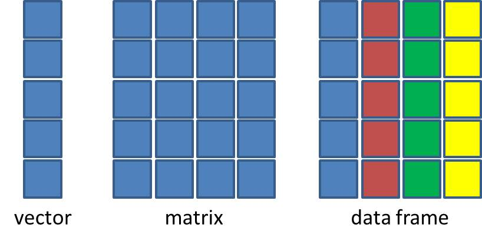

## Sobre mi

::::: columns
::: {.column width="20%"}

:::

::: {.column width="80%"}
-   Biólogo Marino (2006; UABCS)\
-   Maestría en Uso Manejo y Preservación de los Recursos Naturales (2009; CIBNOR)\
-   Doctor en Ciencias Naturales (Uni Bremen/AWI)\
-   Posdoct Dept Acuicultura (2019 - 2021)\
-   Posdoct Acuicultura (2022 - 2025; CIBNOR)
:::
:::::

------------------------------------------------------------------------

## ¿Que es el Tidyverse?

::::: columns
::: {.column width="30%"}

:::

::: {.column width="70%"}
-   Un conjunto de paquetes de R diseñados para ciencia de datos.

-   Todos los paquetes comparten una filosofía, gramática y estructura.

-   Diseñados para apoyar el flujo de trabajo de cualquier proyecto de análisis de datos.
:::
:::::


------------------------------------------------------------------------

## Paquetes y funciones

{fig-align="center"}

------------------------------------------------------------------------

## ¿Que ventajas tiene usar Tidyverse?

:::: columns
::: {.column width="100%"}
-   Eficiencia y consistencia
-   Simplificación de código
-   [Intuitivo para el humano]{.fragment .highlight-red}
:::
::::

::::::: columns
:::: {.column width="40%"}
::: {.fragment .fade-in}
```{r}
#| echo: false
library(tidyverse)

df <- data.frame(
  nombre = c("Ana", "Juan", "María", "Pedro", "Lucía"),
  edad = c(20, 22, 19, 21, 23),
  nota = c(85, 90, 78, 92, 88),
  ciudad = c("Madrid", "Barcelona", "Valencia", "Sevilla", "Bilbao")
)

df
```
:::
::::

:::: {.column width="60%"}
::: {.fragment .fade-in}
```{r}

base <- df[df$nota > 85, c("nombre", "nota")]
base <- base[order(base$nota, decreasing = TRUE), ]
```
:::
::::
:::::::

------------------------------------------------------------------------

## ¿Que ventajas tiene usar Tidyverse?

:::: columns
::: {.column width="100%"}
-   Eficiencia y consistencia
-   Simplificación de código
-   [Intuitivo para el humano]{style="color:red"}
:::
::::

:::::: columns
::: {.column width="40%"}
```{r}
#| echo: false
library(tidyverse)

df <- data.frame(
  nombre = c("Ana", "Juan", "María", "Pedro", "Lucía"),
  edad = c(20, 22, 19, 21, 23),
  nota = c(85, 90, 78, 92, 88),
  ciudad = c("Madrid", "Barcelona", "Valencia", "Sevilla", "Bilbao")
)

df
```
:::

:::: {.column width="60%"}
::: {.fragment .fade-in}
```{r}
#| eval: false
tidy <- df %>%
  select(nombre, nota) %>%
  filter(nota > 85) %>%
  arrange(desc(nota))
```
:::
::::
::::::

------------------------------------------------------------------------

## ¿Realmente necesito aprender a usar Tidyverse?


------------------------------------------------------------------------

## ¿Quien desarrolla Tidyverse?

:::: columns
::: {.column width="100%"}

:::
::::

<br>

::::: columns
::: {.column width="50%"}

:::

::: {.column width="50%"}

:::
:::::

------------------------------------------------------------------------

::::: columns
::: {.column width="50%"}
**R**

{fig-align="center"}
:::

::: {.column width="50%"}
**Rstudio**

{fig-width="150%" width="597"}
:::
:::::

------------------------------------------------------------------------

## Rstudio

**I**ntegrated **D**evelopment **E**nvironemnt (**IDE**)

::::: columns
::: {.column width="70%"}
{fig-align="center" width="707"}
:::

::: {.column width="30%"}
-   Escribir código
-   Navegar archivos
-   Inspeccionar variables
-   Visualizar gráficos
-   Control de versiones
:::
:::::

⚠️ Es necesario tener ambos (R y Rstudio) instalados

------------------------------------------------------------------------

{fig-alt="manos a la obra" fig-align="center" width="751"}


---------------------------------------------------------------------

## Tipos de datos en R

Dentro de las ciencias biológicas hay cuatro tipos de datos en R que podemos encontrar frecuentemente:

1.   **Numéricos** (`1, 2, 3.15, 4.6843`)
2.   **Interger** (`1L, 2L, 3L, 4L`)
3.   **Lógicos** (`TRUE / FALSE`)
4.   **Texto** (`"I love R"`)


## Estructura de datos en R

Hay cuatro estructuras de datos principales en R que son fundamentales para manejar y analizar datos:

::: columns
::: {.column .medium width="50%"}
1.   **Vector**: Una secuencia de datos del mismo tipo (numérico, texto, lógico).
2.   **Matriz**: Una tabla bidimensional de datos del mismo tipo.
3.   **Data Frame**: Una tabla bidimensional de datos que pueden ser de diferentes tipos.
4.   **Lista**: Una colección de objetos que pueden ser de diferentes tipos y estructuras.
:::


::: {.column width="50%"}
{fig-align="center" width="600"}
:::
:::

## Estructura de datos en R

### Vectores

```{r}

v_numero <- c(1, 2, 3, 4, 5)
v_numero
```

```{r}

v_texto <- c("A", "B", "C", "D", "E")
v_texto
```


{fig-align="center" width="600"}


## Estructura de datos en R

### Matrix

```{r}
m <- matrix(1:9, nrow = 3, ncol = 3)
m

```
{fig-align="center" width="600"}


## Estructura de datos en R

### data.frame

::: columns
::: {.column .medium width="50%"}
```{r}
# dataframe combinando número, texto y lógico
df <- data.frame(
  id = c(1,2,3,4,5),
  nombre = c("Ana", "Juan", "María", "Pedro", "Lucía"),
  aprobado = c(TRUE, TRUE, FALSE, TRUE, FALSE)
) 
df
```
:::

::: {.column width="50%"}

{fig-align="center" width="600"}
:::
:::


# Directorios de trabajo

El directorio de trabajo [*working directory*]{.fragment .highlight-red} es la carpeta donde R busca archivos por defecto.

Para saber en que carpeta estas trabajando, puedes usar el comando

```{r}
getwd()
```

y para establecer un directorio de trabajo.

```{r}
#| eval: false
setwd()
```

------------------------------------------------------------------------

::::: columns
::: {.column width="50%"}

:::

::: {.column width="50%"}

:::
:::::

Puedes leer la discusión [aqui](https://www.tidyverse.org/blog/2017/12/workflow-vs-script/){target="_blank"}

------------------------------------------------------------------------

```{r}
#| eval: false
#| code-line-numbers: "|1,2,3,4,5|7,8"

library(ggplot2)
setwd("/Users/miguel/documentos/analisis/data")
df <- read.delim("datos_crudos.csv")

p <- ggplot(df, aes(x, y)) + geom_point()

setwd("/Users/miguel/documentos/analisis/figuras")
ggsave("figura_scatterplot.png")
```

La posibilidad de que esto tenga el efecto deseado en alguien mas es de 0%

::: {.fragment .fade-in}
{fig-align="center" width="500"}
:::

# Flujos de trabajo en proyectos

::::: columns
::: {.column width="40%"}
{width="743"}
:::

::: {.column width="60%"}
**Ventajas**:

-   Facilita trabajar con rutas relativas
-   Mantiene organizados tus scripts, figuras, tablas, etc.
-   Mejora la reproducibilidad
-   Evita el uso de `setwd()`
:::
:::::

------------------------------------------------------------------------

{fig-alt="manos a la obra" fig-align="center" width="751"}


