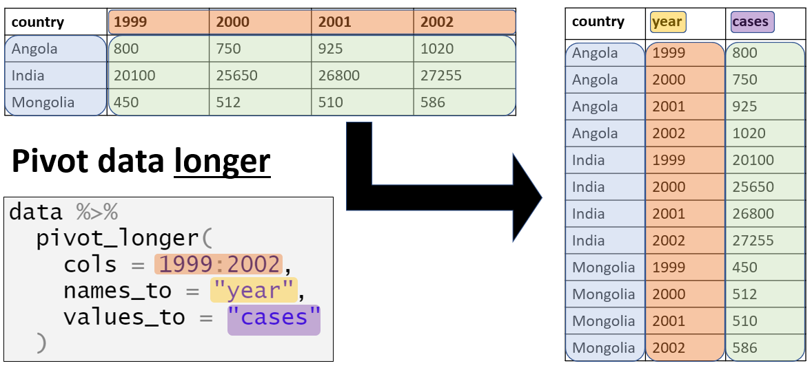
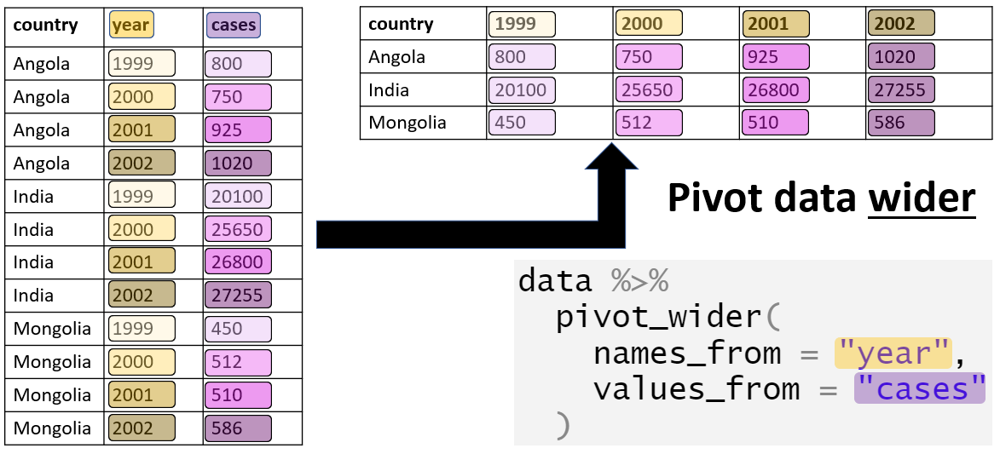
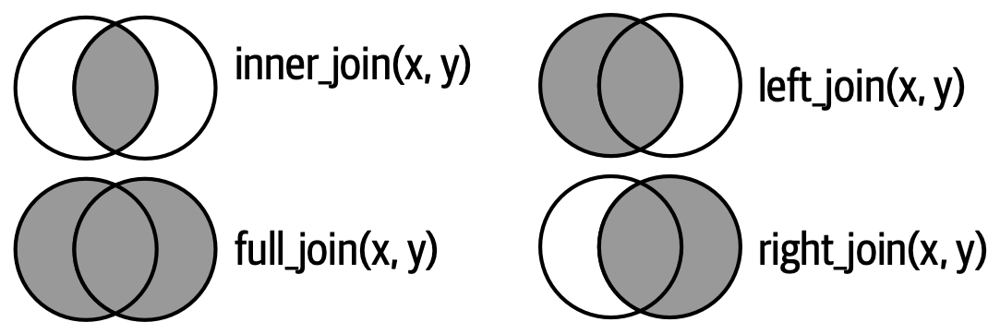

------------------------------------------------------------------------

```{r}
#| echo: false

library(tidyverse)
library(here)
```

:::::: columns
::: {.column .smaller width="33.33%"}
```{r}
#| echo: false
#| message: false
table1 %>% 
  knitr::kable(caption = "tabla 1")


```
:::

::: {.column .smaller width="33.33%"}
```{r}
#| echo: false

```
:::

::: {.column .smaller width="33.33%"}
```{r}
#| echo: false

```
:::
::::::

------------------------------------------------------------------------

:::::: columns
::: {.column .smaller width="33.33%"}
```{r}
#| echo: false
#| message: false
table1 %>% 
  knitr::kable(caption = "tabla 1")


```
:::

::: {.column .smaller width="33.33%"}
```{r}
#| echo: false
table2 %>% 
  knitr::kable(caption = "tabla2")
  

  
```
:::

::: {.column .smaller width="33.33%"}
```{r}

```
:::
::::::

------------------------------------------------------------------------

## 

:::::: columns
::: {.column .smaller width="33.33%"}
```{r}
#| echo: false
#| message: false
table1 %>% 
  knitr::kable(caption = "tabla 1")


```
:::

::: {.column .smaller width="33.33%"}
```{r}
#| echo: false
table2 %>% 
  knitr::kable(caption = "tabla2")
  

  
```
:::

::: {.column .smaller width="33.33%"}
```{r}
#| echo: false
table4a %>% 
  knitr::kable(caption = "tabla4a: casos")

table4b %>% 
  knitr::kable(caption = "tabla4b: población")
```
:::
::::::

## Tidy data

-   Cada variable debe tener su propia columna.
-   Cada observación debe tener su propia fila.
-   Cada valor debe tener su propia celda.


## Tidy data

::: {.callout-caution icon="false"}
# Desafio

Intenta calcular la `tasa` (casos / población) por país y por año en cada una de las tabla. ¿En cual de ellas es mas fácil?
:::

## Tidy data

::: smaller
| Especie | Sitio | Altura_ene | Altura_Feb | Altura_Mar | NumHojas_Ene | NumHojas_Feb | Numhojas_Mar |
|---------|---------|---------|---------|---------|---------|---------|---------|
| Pino | Bosque | 12 | 15 | 18 | 30 | 35 | 40 |
| Pino | Pradera | 10 | 12 | 14 | 28 | 32 | 34 |
| Roble | Bosque | 20 | 24 | 28 | 40 | 45 | 50 |
| Roble | Pradera | 18 | 20 | 22 | 35 | 38 | 42 |
:::

{fig-align="center" width="590"}

## Tidy data

Para arreglar estos problemas en el formato de los datos tabulados, vamos a necesitar de dos de las funciones mas importante de tidyr: `pivot_longer()` y `pivot_wider()`

{fig-align="center" width="457"}

## pivot_longer()



## Ejercicio: Respiración

En el archivo `respiracion.csv` puedes encontrar datos de consumo de oxígeno de diversos organismos expuestos a dos condiciones experimentales (*"Control"* y *"Experimental"*). Abre el archivo y modifica la tabla para que puedas calcular el **promedio diario** del consumo de oxígeno y graficalo.

## Ejercicio: Respiración

```{r}
#| include: true
#| code-fold: true
#| code-summary: "ver codigo"
#| eval: true
#| message: false
#| warning: false

respiracion <- read_csv(here("data/respiracion.csv"))

respiracion_plot <- respiracion %>%  
  pivot_longer(c(-individuo, -experimento), 
               names_to = "dia", 
               values_to = "respiracion") %>%  
  group_by(experimento, dia) %>% 
  summarise(respiracion_promedio = mean(respiracion, 
                                        na.rm = TRUE)) %>%  
  ungroup() |> 
  ggplot(aes(x = dia, 
             y = respiracion_promedio, 
             group = experimento, 
             color = experimento))+
  geom_line()
  
respiracion_plot
```

## pivot_wider()



## Unir tablas

Todos tienen la misma interfaz: toman un par de marcos de datos (*x* , *y*) y devuelven un marco de datos. El orden de las filas y columnas en la salida está determinado principalmente por *x*.

::::: columns
::: {.column .smaller width="50%"}
{fig-align="center"}
:::

::: {.column .smaller width="50%"}
-   left_join(): conserva todas las filas de x. Si alguna clave de x no encuentra coincidencia en y, se rellena con NA en las columnas de y.

-   right_join(): conserva todas las filas de y. Si alguna clave de y no encuentra coincidencia en x, se rellena con NA en las columnas de x.

-   full_join(): conserva todas las filas de x y de y. Si alguna clave no tiene coincidencia en la otra tabla, se completan las columnas faltantes con NA.

-   inner_join(): conserva solo las filas con claves que coinciden en ambas tablas.
:::
:::::

## Unir tablas

Otra forma de verlo...

{fig-align="center" width="860"}


# Ejercicio: Pokéfusion 

::: columns
:::{.column .medium width="75%"}
Abre las tablas de `pokemon.csv` y `pokemon_extended.csv` que se encuentran en la carpeta de `data`.

Usando una sola cadena, une ambas tablas de manera que se retengan todos los individuos con información en ambas tablas

-   ¿Que pasa si no defines la variable de unión `by =`?
-   ¿Que problema encuentras con el nombre de la variable de unión?


```{r}
#| include: true
#| code-fold: true
#| code-summary: "ver codigo"
#| eval: false


pokemon <- read_csv("data/pokemon.csv")

pokemon_extended <- read_csv("data/pokemon_extended.csv")


pokemon %>% 
  inner_join(pokemon_extended, by = c("NAME" = "Name"))
```

:::


:::{.column .medium width="25%"}

{fig-align="center" width="200"}
:::


:::


# Desafio: Rutas metabolicas
:::columns
:::{.column .smaller width="50%"}
Se realizó un experimento para ver cambios en la expresión de genes entre tres tratamientos sometidos a condiciones experimentales diferentes, cada condición con tres replicas.

Como resultado del análisis de expresión diferencial de genes se obtuvieron dos bases de datos:

-   `RNAseq_GED_Deseq2_P0.05.txt` con la lista de genes expresados diferencial mente y su valor de abundancia (expresión) en cada uno de las replicas.
-   `RNAseq_enrich_kegg.txt` con los resultados de las principales rutas metabólicas enriquecidas y los genes que se encuentran en cada ruta.

Importa ambas bases de datos y en una sola cadena gráfica los valores de expresión de cada replica de cada tratamiento de los genes que estén involucradas en cualquier proceso catabólico `catabolic process` tal como se muestra en la imagen.
:::


:::{.column .smaller width="50%"}
```{r}
#| include: true
#| code-fold: true
#| code-summary: "ver codigo"
#| eval: true
#| message: false
#| warning: false


# abrir lista de genes expresados diferencialmente
ged <- read_delim(here("data/RNAseq_GED_Deseq2_P0.05.txt"))

enrich <- read_delim(here("data/RNAseq_enrich_kegg.txt"))


enrich %>% 
  filter(str_detect(Term, "catabolic")) %>% 
  separate_rows(Genes, sep = ",") %>% 
  select(Genes, Term) %>% 
  inner_join(ged, by = c("Genes" = "gene")) %>% 
  select(Genes, Term, contains("_rep")) %>% 
  pivot_longer(c(-Genes, -Term), names_to = "muestra", values_to = "expresion") %>% 
  separate(muestra, into = c("condicion", "replica"), sep = "_") %>% 
  ggplot(aes(x = Genes, y = expresion, color = condicion))+
  geom_point(position = position_dodge(0.3))+
  facet_wrap(~Term, scales = "free_x")+
  labs(y = "Expresión", color = "Condición")+
  theme_light()
  
```
:::

:::
